# Using Lex to Query and Book Flights

This sample application, that let users to query and book flights vocally, is built based on <https://github.com/awslabs/aws-lex-browser-audio-capture>, a simple webpage written in html & javascript.

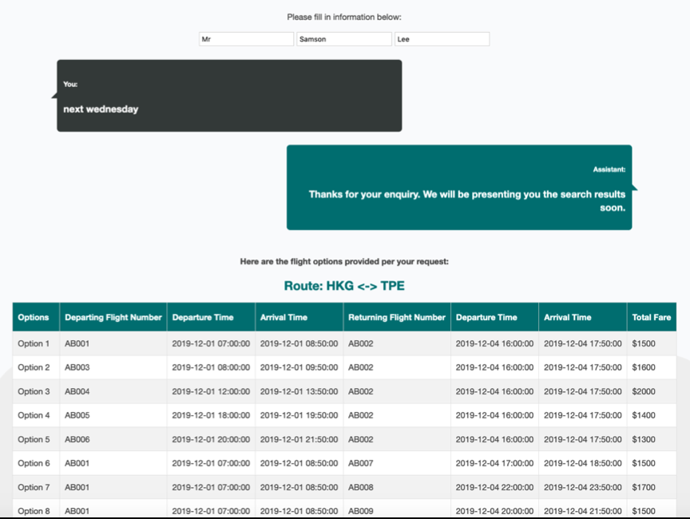

This sample will walk you through:

1.  Using Lex on AWS console to train a conversation model

2.  Register AWS Cognito Identity Pool for using Lex in your application

3.  Spotlights of where the application sample code works with Lex

## Part 1. Building a Chat Bot with Amazon Lex

Login to the AWS Console:

<https://aws.amazon.com/console/>

Search for Amazon Lex in the "Find Services" field (This sample code is developed using US East - N.Virginia region, if you prefer other regions, you might need to customize the sample code later)

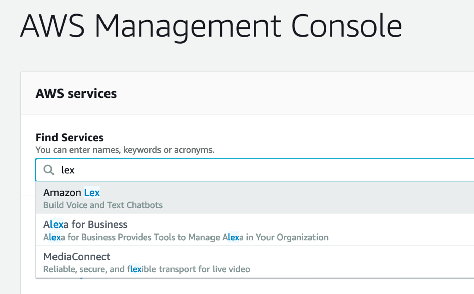

Select "Create" to create a new Bot

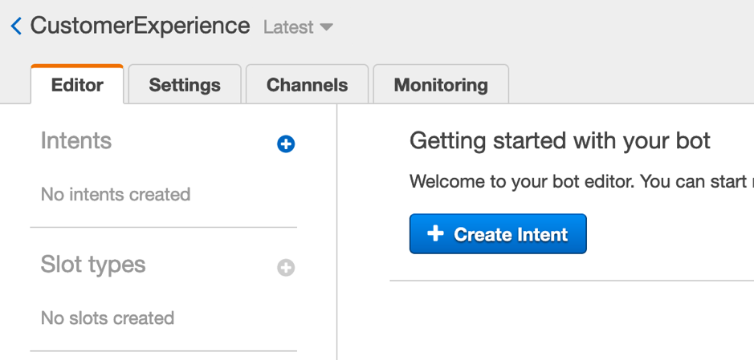

Select "Custom bot", and give your bot a name. Also select an output voice that you prefer, you may
listen to the voice but providing a sample sentence. Then input "5 min"
for Session timeout and "No" for COPPA. Confirm all the input has been
filled in then can create the bot.

Now we need to create some intents

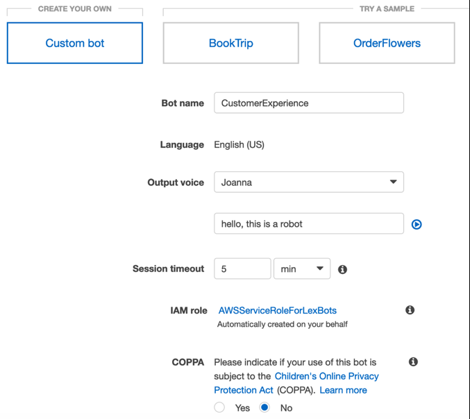

Select "Create intent" then give your intent a name -- "SearchFlights",
then click "Add".

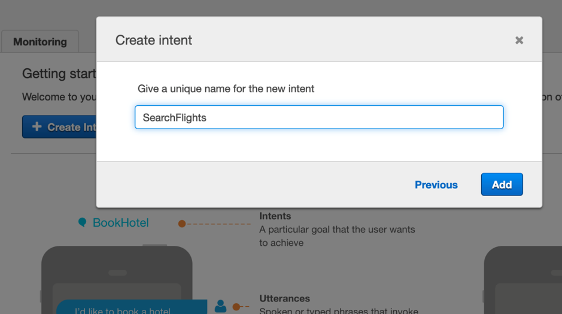

Create slot type for capturing required information from the
conversation. In this case we need to capture codes of the airports as
examples

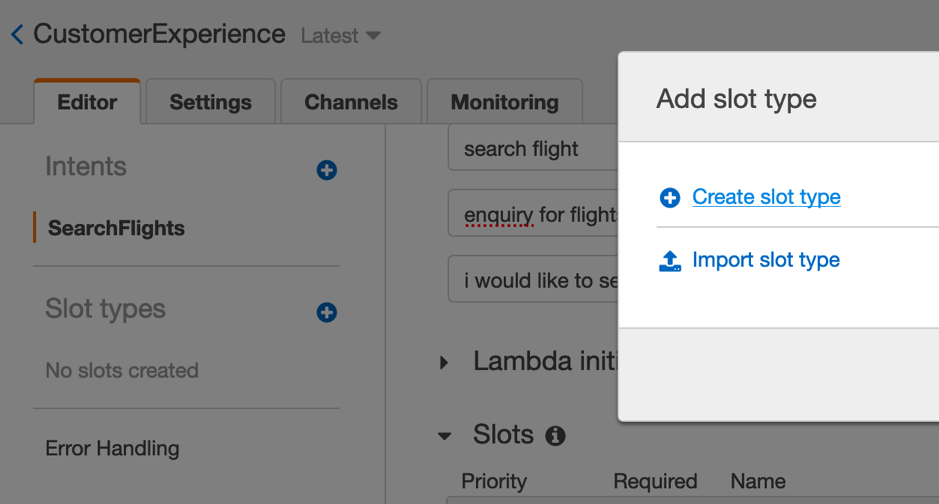

Name the Slot type "airportCodes", and select "Restrict to Slot values
and Synonyms"

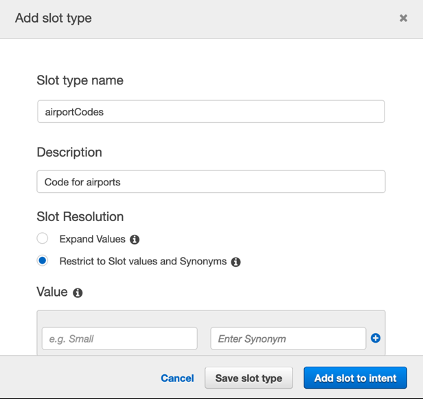

Create values per below, then click "Add slot to intent"
(You may feel free to customize the locations / airports that you
prefer, or using built-in slots)

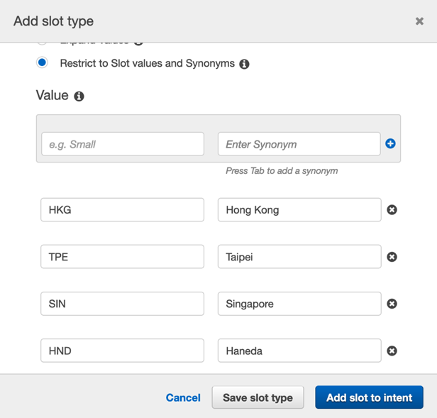

Then back at the slot sections, for both origin and destination, you can
use airportCodes that we have just created from the "Custom Slot", while
for departureDate and returnDate, you can use the "built-in slot" by
Amazon -- AMAZON.DATE. Also fill in the relevant Prompt.

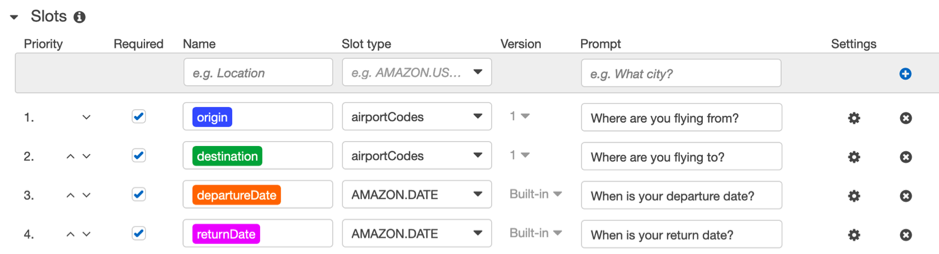

Input some sample sentences per below as "Sample utterances". Notice that you can refer the defined slots in the utterances by curly braces, e.g. "flying from {origin} to {destination}"

Lastly, select "Return parameters to client" for Fulfillment, and
provide a generic message for now as a response message (e.g. Thank you
for your enquiry) Please note you can as well pass the collected slots
value to a Lambda function if your response would need some logic to
process before passing back to the user.

**\[Important\]** When all required fields have been inputted, remember
to click "Save intent", otherwise you will lose all input.

After that, build the bot and wait for its completion.

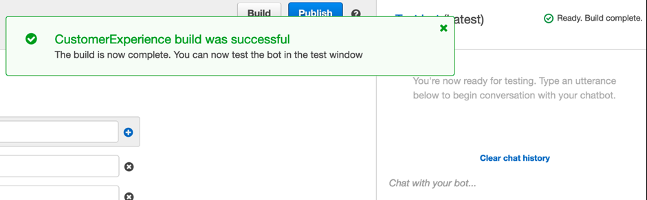

Now you can use the testing console on the right-hand side to test the
bot.

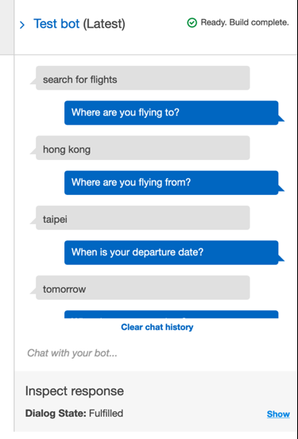

Then, create another intent and name it "PurchaseTickets"**

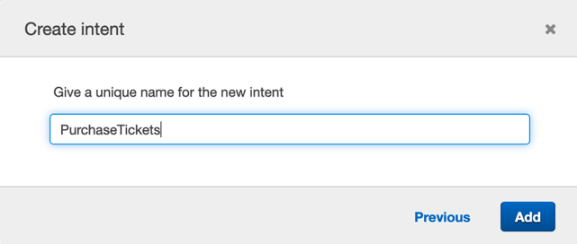

Then input utterances again and only 1 slot this time, called
"option", choose AMAZON.NUMBER for the slot type.

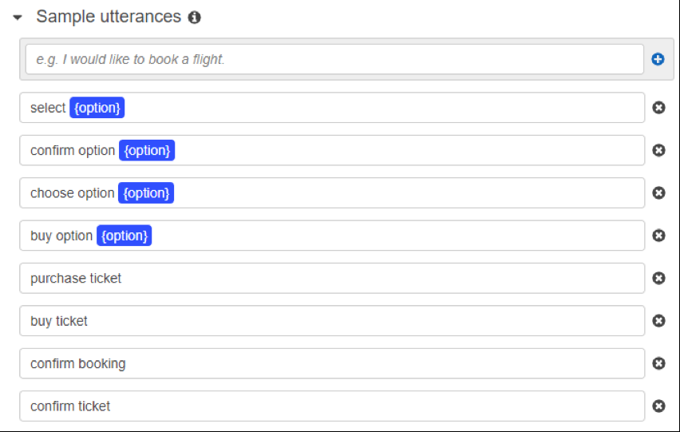

When it's all good, build the bot again. Then now you may publish the
bot.

Give it an alias (e.g. beta / demo / testing), used for identification
of your current version before publishing

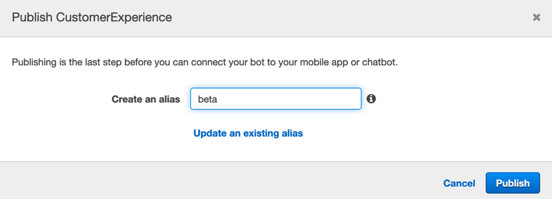

## Part 2. Getting the Amazon Cognito Identity Pool Identifier

For simplicity, the example uses an anonymous Amazon Cognito identity pool to provide unauthenticated access to the Amazon APIs. This might be suitable for your needs. For example, you can use unauthenticated access to provide free, or trial, access to your website before users sign up.

To provide authenticated access, use an Amazon Cognito user pool. For more information, see [Amazon Cognito User Pool](https://docs.aws.amazon.com/cognito/latest/developerguide/cognito-user-identity-pools.html).

The following procedure shows how to create an identity pool that enables access to unauthenticated identities, and how to get the identity pool identifier that\'s needed in the example code.

To get the identity pool identifier:

1.  Open the Amazon Cognito
    [console](https://console.aws.amazon.com/cognito/federated).

2.  Choose Create new identity pool.

> 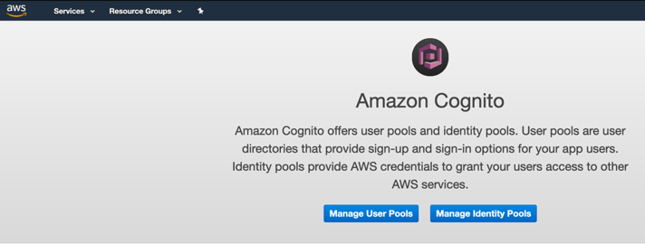

3.  For Identity pool name, type a name for your identity pool
    (e.g. Demo-Id Pool)

4.  In **Unauthenticated identites**, choose **Enable access to unauthenticated identities**.

5.  Choose **Create Pool**.

6.  Choose **View Details**, and note the role name for unauthenticated
    identities.

7.  Choose **Allow**.

8.  In **Platform**, choose **JavaScript**.

9.  In **Get AWS Credentials**, note the values of *Identity pool
    identifier (Id)* and *region* that are shown in the code snippet.

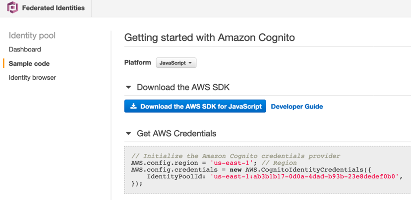

10. Open the IAM console at <https://console.aws.amazon.com/iam/>.

11. In the navigation pane, choose **Roles**.

12. Search for the role name that you noted in step 6. (end with "Unauth_Role")

13. In **Permissions**, choose **Attach Policy**.

14. Search for and choose **AmazonRekognitionReadOnlyAccess**.

15. Choose **Attach Policy**.

16. Search for and choose **AmazonLexRunBotsOnly**

17. Choose **Attach Policy**.

18. Go back to the role summary and see if the policies are there.

> 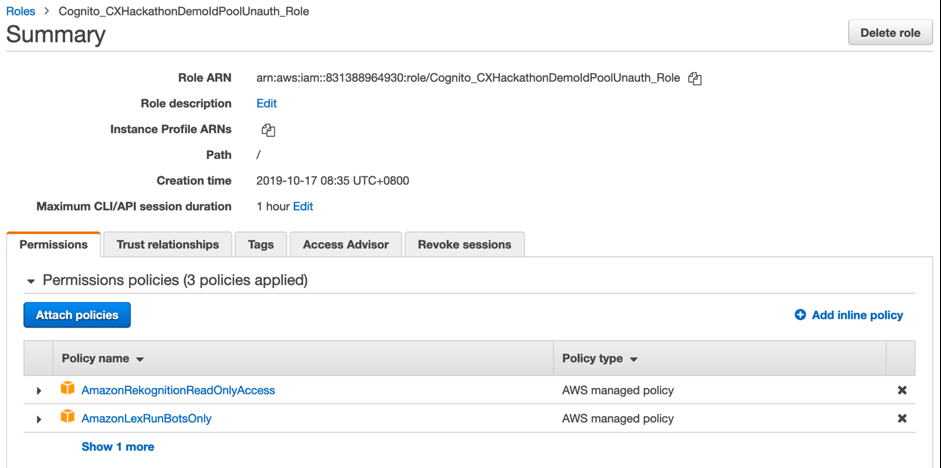

## Part 3. Develop a Web App for Ticket Purchase

Back on AWS Console, create an environment for a service called Cloud 9 (Optional, if you prefer to run the code on your local environment. If so, skip to the git clone step below)
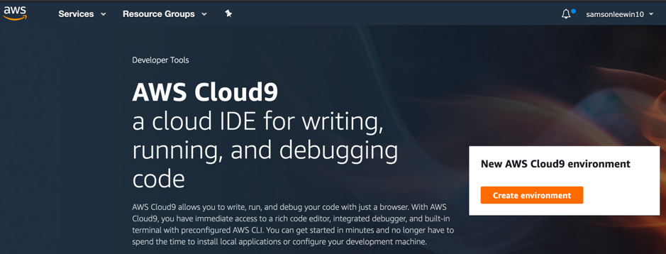

For lower latency in accessing this cloud IDE, you may choose the region closest to yours on the right-top corner as the region before creating an Environment.

Provide a name to the environment in step 1, and configure the values in step 2 per below, and leave the rest as default

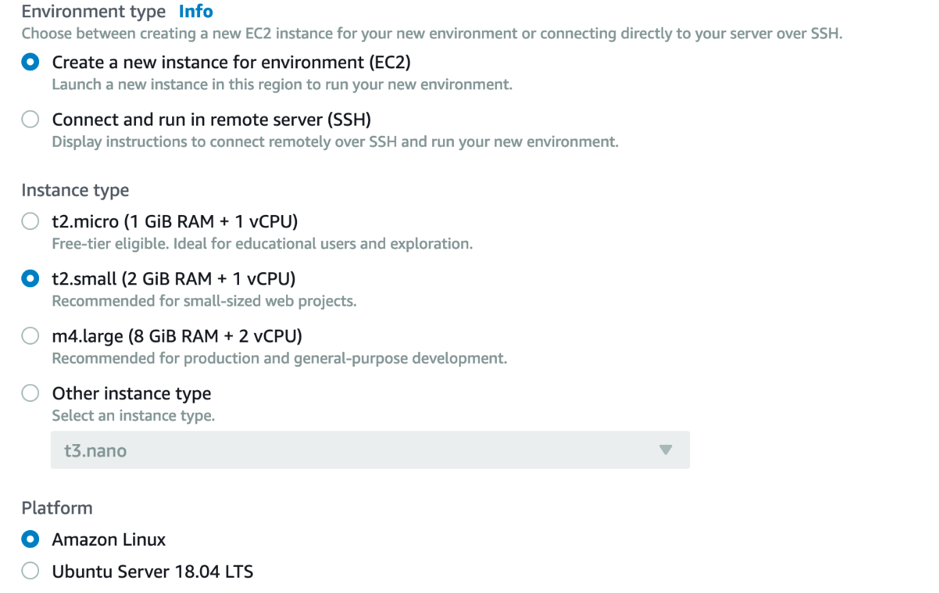

Once the creation is successful, you may run below command line to download the sample project in the terminal provided by Cloud 9:

+---------------------------------------------------------------------+
| git clone <https://github.com/hackathon-demo/ticketPurchaseApp.git> | |
+---------------------------------------------------------------------+

Then you can start to study and edit the code.

Inside /example/index.html, line 76 is where you have to insert the Cognito Identity Pool Id you collected from Part 2.

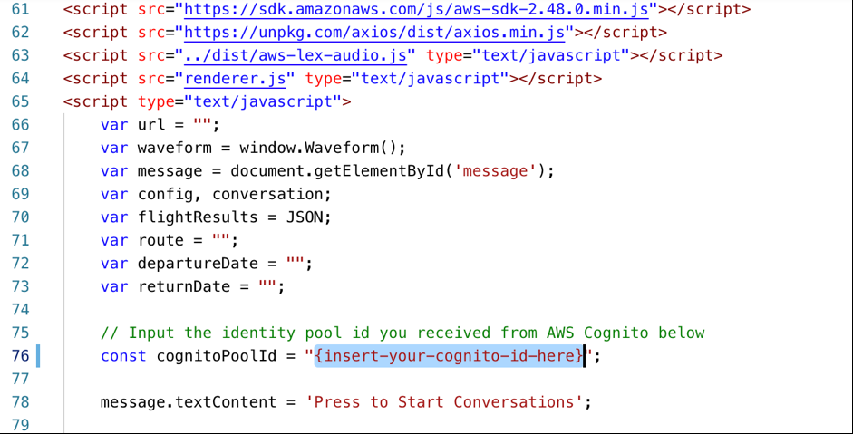

Also you may noticed that line 61 is where you imported the AWS SDK for javascript, so that you can easily interact with just few lines of code. 

After that, you may click preview the index.html file in your browser to test around the app

Press the conversation button, say "Search for flights", to start
interact with the bot, or can reference from scripts below in sequence.

1.  You: "Search for flights"

2.  Assistant: "Where are you flying to?" \|\| You: "Taipei"

3.  Assistant: "Where are you flying from?" \|\| You: "Hong Kong"

4.  Assistant: "When is your departure date?" \|\| You: "tomorrow"

5.  Assistant: "When is your return date?" \|\| You: "next Monday"

Then follow by the "Purchase tickets" scenario

1.  You: "Purchase tickets"

2.  Assistant: "Which option below ..." \|\| You: "Three"

After purchasing the ticket, you shall see the selected option has been
extracted.

Here to highlights different parts of the code that makes this demo
work:

1.  Customize the time length of silence before Lex sending out the audio by modifying the attribute value for "time" in ms, and the amplitude level to distinguish noise from the recording, through a threshold value from 1 to -1

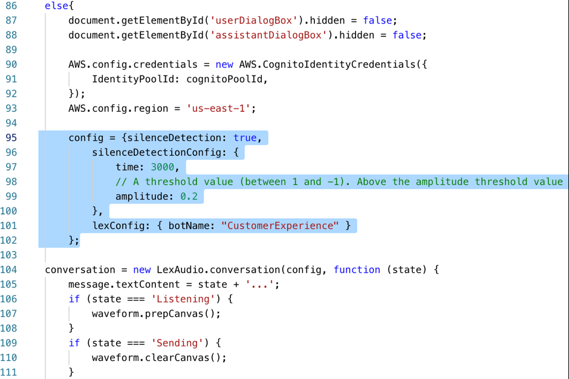

Also be aware that for "lexConfig" (line 101), remember to make sure the bot name is the same as the one you defined in Part 1 earlier.

2.  Through the response back from Lex (defined as "data" from line 112), the application can be developed to respond by different attributes.

    **data.inputTranscript (line 114):**\
    The transcribed sentence from the user\
    \
    **data.message (line 115):**\
    The responded message from Lex according to the model trained from
    Part 1 of this sample project\
    \
    **data.dialogState (line 119):**\
    Refers to the state of the dialog, for example here, "Fulfilled"
    means it has captured all the required slots value\
    \
    **data.intentName (line 123):**\
    The intent of the dialog detected by Lex\
    \
    **data.slots.destination/departureDate/returnDate/... (line
    132-134):**\
    To extract the slots values captured from the dialog

3.  The API being called for now is just being mocked by returning a static JSON file (line 213-222)

> 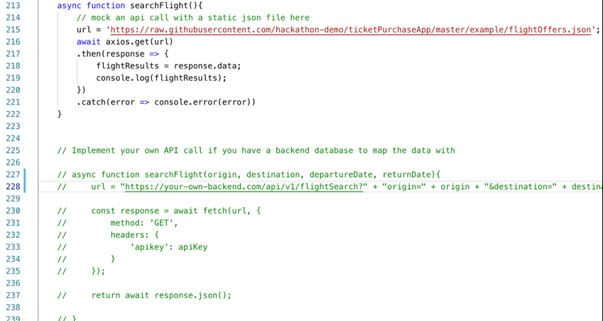
> \
> Line 227-239 provides a sample usage of an API call that in case you
> have an authentic backend that can query flight schedules with the
> collected data from Lex (or add in your customization to collect
> more), this could be a sample for you to get the response back.

In summary, this sample focus on the usage of

\-\--The End\-\--
